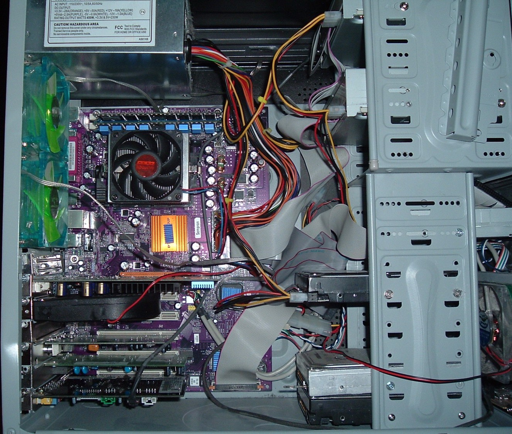

# Why?
## It works on my machine...
::: {.incremental .conversation}
- Hi! Interesting results you have. Could I try out your code?
- Sure, ~~just drop me an email!~~ check out my Github page!
- I'm having problems compiling your program.
- Oh, what version of GFortran are you running?
:::

## A longer conversation
::: {.incremental .conversation}
- Now its complaining about a library...
- Oh ya, I'm running a patched version of that library.
- Eeerm ...
- Let me send you my hard drive!
:::

## Question
Why do you think containers are useful to you?

## You want to use software
- Run software that's not available on your OS
- Run software that's hard to install on any OS
- Dealing with many dependencies
- Check results against different versions of same software
- Reproduce a colleague's results

## You want others to run yours
- Deployment: have it work on someone elses computer
- Your users complain about not being able to install
- Have a colleague check your results

## Question
How did your struggles impact the quality of your work?

# Inception: levels of the virtual
## What is a computer, physically?
:::container
:::col
- CPU
- Memory
- Disk
:::
:::col

:::
:::

## And what else?
- Software:

  :::incremental
  - Kernel
  - Libraries
  - Executables
  :::

## Can we change the Kernel?
- Swap out the hard drive
- Dual boot
- Virtual machine

## Change libraries
- Chroot
- Static linking
- Containers

# Containers and Images
## Image
- An image is like a harddrive
- If we're baking cookies: the cookie template

## Container
- A container is like a running computer
- If we're baking cookies: the cookie! yum

